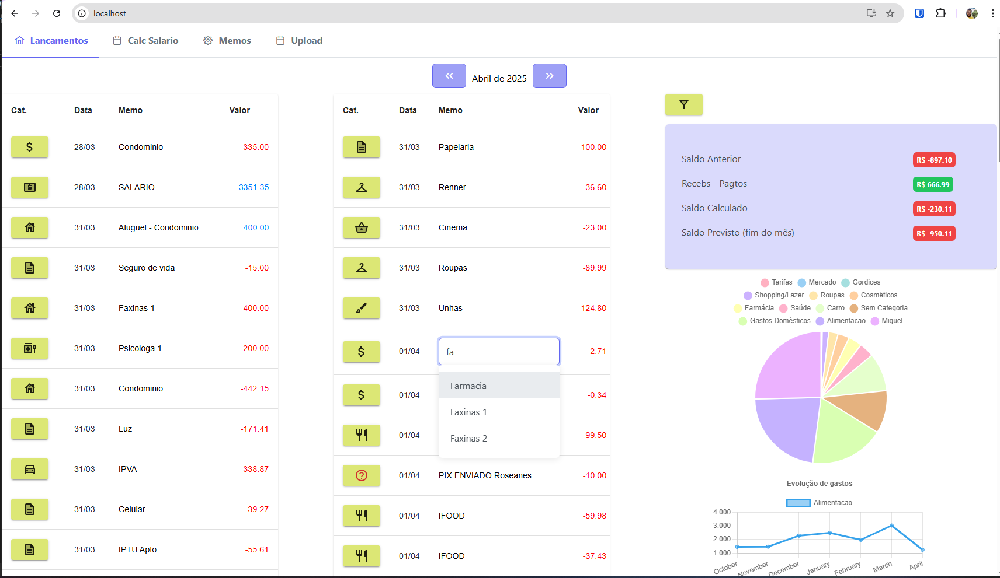
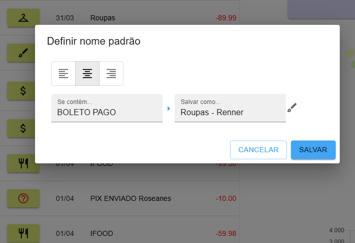

# Orçamento-React

## ENG

This is a localhost simple project for personal use, made with ReactJS, C# REST Api and MongoDB, which runs a small app to write down your finances every month.

The application lets you import OFX bank files, and show the month entries in a categorized list between fixed and variable expenses. For instance, you can configure that the recurring entry `RSHOP*PadariaDoZé`will always appear as `Bakery` in the `Food` category, making your organization easier!

### Other features:
- Categorize expenses
- Rename recurring expenses with an Autocomplete list
- Move expenses beween next/previous month (like when you get your salary on 30/03 but would like it to appear in April)
- Split an expense in several entries (like when you receive a $400 deposit, but woul like to show it as 2 entries of $200)

### Disclaimers

This is a base project for you to work on and customize to your needs!
As a simple project:
- It has NO authentication!
- It has NO security!
- It has NO user or password!
...therefore, improve the security yourself, or only use it in your personal computer!

This project deals with OFX files from brazillian banks (it has not been testes with other banks), and with Real (BRL) currency.

### How to install

1. Install MongoDB community
2. Configure the `MongoUrl`address in the backend, in appSettings.json file (ex: `mongodb://127.0.0.1:27017`)
3. Run the backend API
4. Execute the POST method:  `SetupDatabase` from `LiveController` (use the Swagger interface that opens up when you run the solution!) - This will install the MongoDB collecitons for first use
5. Confirm the API address on frontend `.env` file
6. Start the frontend, using the `npm install` and `num start`commands

## PT-BR

Este é um projetinho para uso pessoal, feito em ReactJS, Api REST C# e MongoDB, que roda uma aplicação pequena para anotar suas finanças de cada mês.

A aplicação permite você importar arquivos OFX do seu extrato bancário, e exibir em uma lista já categorizada entre gastos fixos e variáveis, transformando seu extrato em descrições legíveis. Por exemplo, você pode configurar que toda vez que houver uma entrada `RSHOP*PadariaDoZé` em seu extrato, ela seja sempre importada como `Padoca` na categoria `Alimentação`, facilitando sua organização!

### Outras funcionalidades:
- Categorizar gastos
- Renomear entradas para nomes frequentes, com uma lista Autocomplete
- Mover entradas para o mês seguinte/anterior (ex: quando você recebe dia 30/03, mas gostaria que essa entrada aparecesse no mês de Abril)
- Dividir um lançamento em vários (ex: Quando você recebe um depósito de 400, mas gostaria de exibir 2 lançamentos de 200)

### Disclaimers

É um projeto base para você melhorar e personalizar às suas necessidades!
Por ser um projeto simples:
- Não possui autenticação!
- Não possui segurança!
- Não possui usuário e senha!
...portanto, melhore você mesmo a segurança, ou somente use em um computador pessoal!

O projeto lida com arquivos OFX de bancos brasileiros (não foi testado com todos os bancos!), e com moeda no padrão Real (BRL)

### Como instalar

1. Instale o MongoDB community
2. Configure o endereço `MongoUrl` no backend, no arquivo appSettings.json (ex: `mongodb://127.0.0.1:27017`)
3. Rode a API backend
4. Execute o método POST:  `SetupDatabase` do `LiveController` (utilize a interface Swagger que abre ao rodar a solução!) - Isto irá instalar as coleções no MongoDB para seu primeiro uso
5. Confirme o endereço da API no arquivo `.env` do frontend
6. Inicie o frontend, com os comandos `npm install` e `num start`

